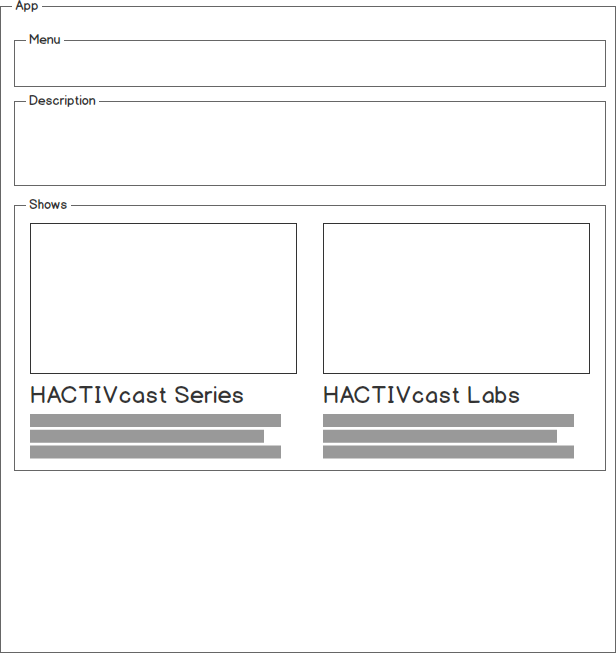

# HACKTIVcast Web

This is website for HACKTIVcast. HACTIVcast is online video tutorial about technology such as NodeJS, JavaScript, Git, VIM, and related technology.

Produced by awesome people behind [HACKTIV8](https://hacktiv8.com/).

## Tech Stack

### Backend

* Platform: [NodeJS](https://nodejs.org)
* Web framework: [Express](http://expressjs.com/)
* Database: [PostgreSQL](https://www.postgresql.org/)
* ORM: [Knex](http://knexjs.org/)
* Test: [Mocha](https://mochajs.org) + [Chai](http://chaijs.com)
* HTTP Library: [Axios](https://github.com/mzabriskie/axios)
* Runner helper: [Concurrently](https://github.com/kimmobrunfeldt/concurrently)

### Frontend

* Module bundler: [Webpack](https://webpack.github.io/)
* View library: [React](https://facebook.github.io/react/)
* CSS Library: [Tachyons](http://tachyons.io/)
* Test framework: [Mocha](https://mochajs.org) + [Enzyme](http://airbnb.io/enzyme/)


## Components




## Getting Started


```sh
git clone
yarn
```

Run the app both server and client

```
yarn dev
```

Run server only

```sh
yarn start
```

Run webpack only

```sh
yarn webpack:watch
```

Run server testing

```sh
yarn test
```

Run react testing

```sh
yarn test:react
```
